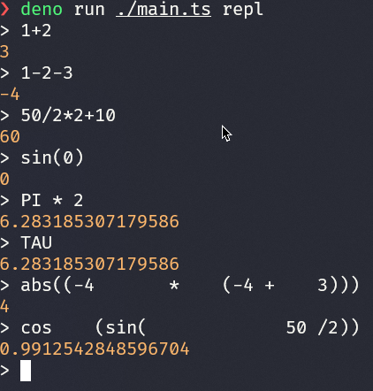

# methor

A simple math parser and evaluator



## Usage

```bash
$ deno run ./main.ts repl
# or
$ deno run ./main.ts 5+3
```

## TODO

- [x] Precedence
  - The deeper an operator parser is in the callstack, the higher precedence it has
- [x] Intersperse calls with whitespace eating
- [x] Negative numbers
- [x] Grouped expressions
- [x] Builtin math funcs
  - [x] sin
  - [x] cos
  - [x] abs
  - [x] pow
- [x] REPL
- [x] Evaluation
- [x] Constants
  - [x] PI
  - [x] TAU
- [x] Fix left/right associativity
  - `50/2*2+10` should evaluate to `60`, not `22.5`
- [x] Tests
- [ ] More operators
- [ ] Floats
- [ ] Unary operators
